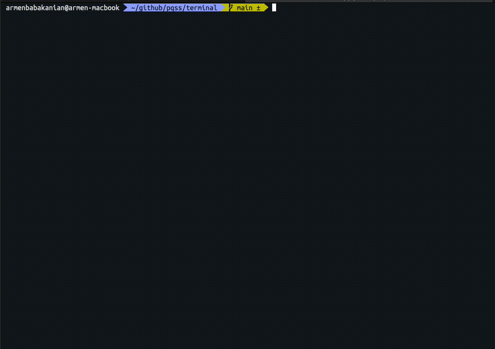

# PQSS | Programmable Query Survey System

This is an open-source typescript system comprised of smaller libraries enabling you to create complex survey systems using code.
The goal is to have a fully compliant Typescript API, that you can create general surveys such for creating tests for students, university research, ux/ui surveys and so much more.

> **Do not use in production** the library is in the very early phases of development.

## Current Feature list:

1. Using API calls, create an run a survey
2. add conditional logic
3. typescript autocomplete checking

## Work In progress:

1. React based UI to collect responses
2. Refactor code, separate out responses to a different collection
3. Create separate UI system to show the flow diagram
4. create survey flow using UI diagram

## Future

3. Vue based UI to collect responses
4. Angular based UI to collect responses
5. svelte based UI to collect response

Example code:

```typescript
const a = survey.addExchange<MultiSelectAttribute>({
  label: "question-a",
  prompt: {
    title: "Question A",
    description: "Description for Question A",
  },
  responseAttributes: {
    type: "multiselect",
    options: {
      "route-b": {
        id: "1",
        label: "Include B",
        value: "b",
      },
      "route-c": {
        id: "2",
        label: "Include C",
        value: "c",
      },
    },
  },
})

const b = survey.addExchange<BooleanAttribute>({
  label: "question-b",
  prompt: {
    title: "Question B",
    description: "Description for Question B",
  },
  responseAttributes: {
    type: "boolean",
  },
})

const c = survey.addExchange<TextInputAttribute>({
  label: "question-c",
  prompt: {
    title: "Question C",
    description: "Description for Question B",
  },
})

// add a connection between questions
survey.addEdge(a, b)

// add a connection, with an optional condition
survey.addEdge(b, c, (response) => {
  // if user has skipped answering exchange b,
  // then continue to c
  if (!response) {
    return true
  }

  // if they answered exchange b, check the value
  // if the value is true, then DON'T move to the
  // next question which is c
  return response.value == true
})

while (true) {
  const x = survey.getNextExchange()
  if (!x) {
    break
  }

  console.log(JSON.stringify(x, null, 2))
}

console.log("finished survey")
```

## Terminal

The terminal is a wrapper around "@inquirer/prompts" that will allow you to load a survey and run it in the terminal.



this is the example code for this terminal run:

```ts
function createSimpleSurvey() {
  const survey = new SurveyExchange()

  const a = survey.addExchange<MultiSelectAttribute>({
    label: "A",
    prompt: {
      title: "Exchange A",
      description:
        "Multiselect, select B to go to B, Selecting C doesn't do anything",
    },
    responseAttributes: {
      type: "multiselect",
      options: {
        b: {
          id: "1",
          label: "Include B",
          value: "b",
          description: "Include the exchange B in the questioners",
        },
        c: {
          id: "2",
          label: "Include C",
          value: "c",
          description: "Include the exchange C in the questioners",
        },
      },
    },
  })

  const b = survey.addExchange<BooleanAttribute>({
    label: "B",
    prompt: {
      title: "Exchange B",
      description: "Boolean, select yes to move to C",
    },
    responseAttributes: {
      type: "boolean",
    },
  })

  const c = survey.addExchange<BooleanAttribute>({
    label: "C",
    prompt: {
      title: "Exchange C",
      description: "Boolean, select no to move to D",
    },
    responseAttributes: {
      type: "boolean",
    },
  })

  const d = survey.addExchange<TextInputAttribute>({
    label: "D",
    prompt: {
      title: "Exchange D",
      description: "Textinput, has no effect",
    },
    responseAttributes: {
      type: "textinput",
      minWords: 20,
      maxWords: 50,
      isRequired: false,
    },
  })

  // edge conditions, are only determined based on the
  survey.addEdge(a, b, (response) => {
    if (!response) {
      return false
    }

    if (!("b" in response.options)) {
      return false
    }

    return true
  })

  survey.addEdge(b, c, (response) => {
    if (!response) {
      return false
    }

    return response.value == true
  })

  survey.addEdge(c, d, (response) => {
    if (!response) {
      return false
    }

    if (response.value == false) {
      return true
    }

    return false
  })

  // survey.addEdge(a, d)
  return survey
}
```
